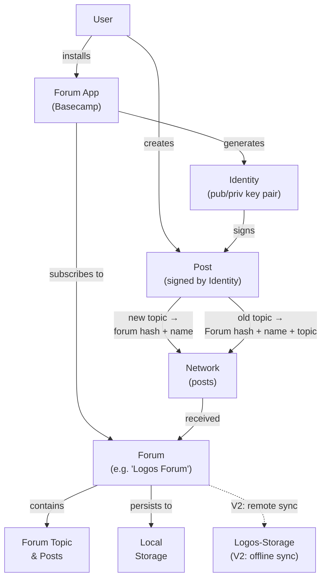
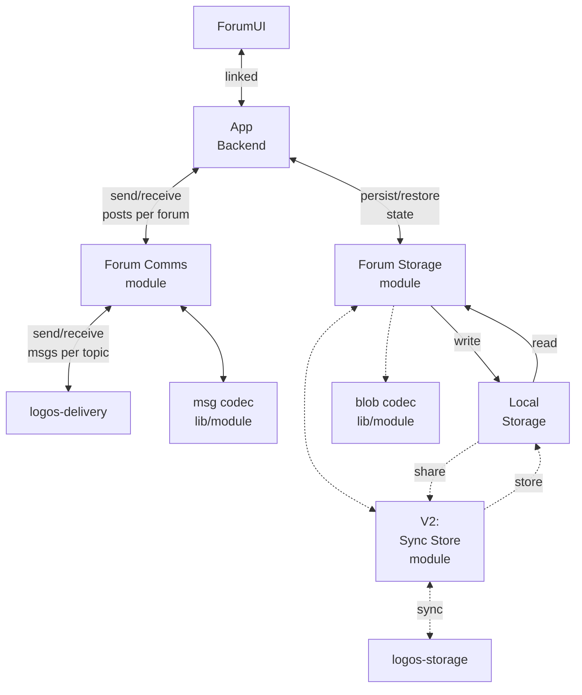

# Anonymous Forums

## Functional requirements (F of FURPS)

Note: here "subscribed" and "topic" refer to app layer terminology.
The first version is just text and ephemeral. V2 uses storage for larger sized content (images) and backing up/restoring chats

### Forums

- A user installs the forum Basecamp app, which has an initial default forum called "Logos Forum"
- V2: They can add/create other forums by name (or alternatively clone the forum app and change the default name).

### Posts

- A user will receive posts to forums they're subscribed to ("Logos Forum" is initially subscribed to)
- A user can send a few types of public messages to the forum:

| Type           | Topic | Text | Img (v2) | reply | Author |
| -------------- | ----- | ---- | -------- | ----- | ------ |
| New topic      | New   | post | opt.     | NA    | sig    |
| Existing topic | (id)  | post | opt.     | opt.  | sig    |

- Public posts directed to a subscribed forum are received and stored locally to render in a UI
- V2: Images
- V2: Private posts can also be sent to a forum, encrypted for a particular group

### Identity (v2?)

- A user has one (v2: or many) unique identifiers
- Posts are signed
- On installation, the app generates a new id for the user
  - A user may wish to import their own id
- It should be practically impossible for a user to create the identity of another user

### V2: Post history

- A user can browse past posts that were sent when they were not subscribed to receive them

### Usage overview

## Arch/components (ADR)

Note:
- Based on current state of modules depended on, will evolve with updates to functionality & documentation.
- [ref-repos](ref-repos) refers to manully checked out repos for AI agents to refer to, .gitignor'ed since they are not part of the app. If referenced often, can hit repo hosting api limits.

### Overview

Like logos-chat, but public with shared messaging topics to subscribe to.

#### Assumptions

- msg topics assumed to be long lived, so can be used between generic delivery and storage sync ("Sync Store")

### Forum UI

The user interacts with the UI as specified in [functional reqs](#functional-requirements).
Action is taken via the C++ backend:

- modify forum & topic subscriptions
- send/receive posts
- persist/load state to/from local storage

### Forum Comms module

- Wraps logos-delivery
- Manages msg-topic subscriptions
- Uses a module (starting as just a lib) to encode/decode forum posts to/from msgs
  - helper functions between forum name/topics converstions can be here
- Send/receive forum posts as delivery msgs

### Forum Storage module

- Saves forum posts to local storage, so previously received msgs can be restored.
- Uses a module (start as a lib) to encode/decode many delivery msgs into blobs
  - blobs scoped per forum/topic, and time-based
- V2: sync blobs with others on the network via a wrapper to logos-storage

---

### Forums (aka "cells")

Each forum should start with a name, this can be used with a domain prefix to uniquely specify messages on the network intended for a forum.
For example: hash("Forum") + "Logos Forum" can be an initial forum people join, and discover other forums.

### Posts

- created locally and shared on the forum topic
- To begin a all posts can be shared to: hash("Forum") + "Logos Forum"
  - Consider only sending new forum topics to entire forum's messaging topic
  - Then posts to existing forum topics sent to: hash("Forum") + "Logos Forum"+ "Forum topic"

### Identity

- public/private identity key pair
- Posts signed by private key so post authors can be verified

### V2: Post History

- Data blobs of past msgs per topic saved to storage
- app can participate in backup
- A form of pagination to incrementally trace back msg history
